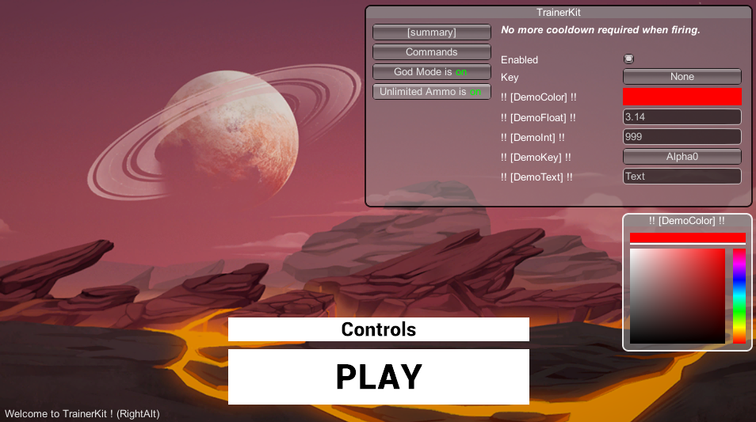
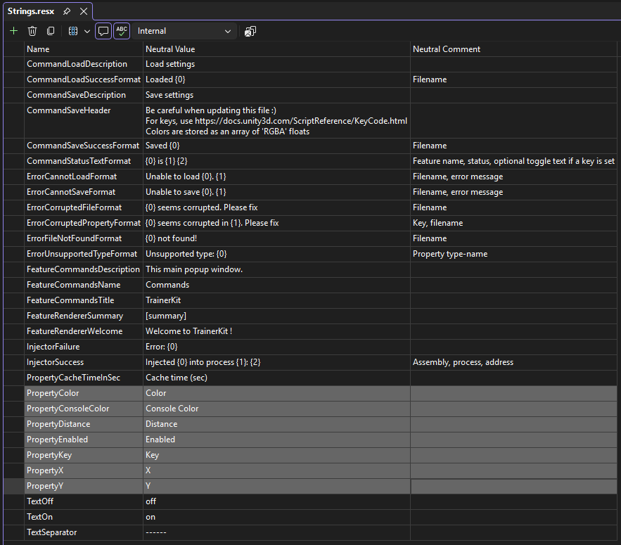

# TrainerKit-Il2cpp

[](https://github.com/sponsors/sailro)

`TrainerKit-Il2Cpp` is an extract of the Feature-system developed for [EscapeFromTarkov-Trainer](https://github.com/sailro/EscapeFromTarkov-Trainer), for games compiled with the Il2Cpp backend. For the Mono backend, you can use [TrainerKit](https://github.com/sailro/TrainerKit).

`TrainerKit-Il2Cpp` simplifies the development of internal Unity trainers by handling:
- UI rendering of features (everything is done automatically through reflection). Support for `Color`, `Float`, `Int`, `String`, `Bool`, `KeyCode` types.
- Load/save of settings.
- Runtime execution of Features.

## Example with Unity's FPS Microgame

Starting with TrainerKit codebase, simply write the following code:

```csharp
using TrainerKit.Features;
using TrainerKit.Properties;
using Unity.FPS.Game;
	
namespace TrainerKit.DemoFPS;

internal class GodMode : ToggleFeature
{
	public override string Name => Strings.FeatureGodModeName;
	public override string Description => Strings.FeatureGodModeDescription;

	protected override void UpdateWhenEnabled()
	{
		var health = Object.FindFirstObjectByType<Health>();
		health?.Invincible = true;
	}

	protected override void UpdateWhenDisabled()
	{
		var health = Object.FindFirstObjectByType<Health>();
		health?.Invincible = false;
	}
}
```

and

```csharp
using TrainerKit.Configuration;
using TrainerKit.Features;
using TrainerKit.Properties;
using Unity.FPS.Game;
using UnityEngine;

namespace TrainerKit.DemoFPS;

internal class UnlimitedAmmo : ToggleFeature
{
	public override string Name => Strings.FeatureUnlimitedAmmoName;
	public override string Description => Strings.FeatureUnlimitedAmmoDescription;

	[ConfigurationProperty] public int DemoInt { get; set; } = 999;
	[ConfigurationProperty] public Color DemoColor { get; set; } = Color.red;
	[ConfigurationProperty] public string DemoText { get; set; } = "Text";
	[ConfigurationProperty] public KeyCode DemoKey { get; set; } = KeyCode.Alpha0;
	[ConfigurationProperty] public float DemoFloat { get; set; } = 3.14f;

	protected override void UpdateWhenEnabled()
	{
		var weapon = Object.FindFirstObjectByType<WeaponController>();
		weapon?.MaxAmmo = int.MaxValue;
	}

	protected override void UpdateWhenDisabled()
	{
		var weapon = Object.FindFirstObjectByType<WeaponController>();
		weapon?.MaxAmmo = 8;
	}
}
```

and the system will automatically generate the following window (use `RightAlt` by default to display the menu):



Note that the system displays names like `!! [Id] !!` because it couldn't find the corresponding entries in the resource file (for example `PropertyDemoInt` for `DemoInt`):




The following configuration file can be automatically generated (and reloaded on next execution):

```ini
; Be careful when updating this file :)
; For keys, use https://docs.unity3d.com/ScriptReference/KeyCode.html
; Colors are stored as an array of 'RGBA' floats

TrainerKit.DemoFPS.GodMode.Enabled=true
TrainerKit.DemoFPS.GodMode.Key="None"

TrainerKit.DemoFPS.UnlimitedAmmo.Enabled=true
TrainerKit.DemoFPS.UnlimitedAmmo.Key="None"
TrainerKit.DemoFPS.UnlimitedAmmo.DemoColor=[1.0,0.0,0.0,1.0]
TrainerKit.DemoFPS.UnlimitedAmmo.DemoFloat=3.14
TrainerKit.DemoFPS.UnlimitedAmmo.DemoInt=999
TrainerKit.DemoFPS.UnlimitedAmmo.DemoKey="Alpha0"
TrainerKit.DemoFPS.UnlimitedAmmo.DemoText="Text"

TrainerKit.Features.Commands.Key="RightAlt"
TrainerKit.Features.Commands.ConsoleColor=[1.0,1.0,1.0,1.0]
TrainerKit.Features.Commands.X=462.0
TrainerKit.Features.Commands.Y=10.0
```


## How to Use

1- `TrainerKit-Il2Cpp` requires [Melon Loader](https://melonloader.co/download.html) installed for your game.

1- Starting from the source code, add the necessary references to the game you want to mod. You need at least:

```text
UnityEngine
UnityEngine.CoreModule
UnityEngine.IMGUIModule
UnityEngine.InputLegacyModule
UnityEngine.TextRenderingModule
```

2- Write your Features, starting from:
```
HoldFeature
ToggleFeature
TriggerFeature
```

Decorate your own properties with `ConfigurationPropertyAttribute`. This will expose your property to rendering and persistence. You can finetune the behavior by using dedicated settings:

```csharp
[AttributeUsage(AttributeTargets.Property)]
public class ConfigurationPropertyAttribute : Attribute
{
	// Skip completely (Rendering+Config), useful when overriding properties
	public bool Skip { get; set; } = false;

	// Dislay order
	public int Order { get; set; } = int.MaxValue;

    // Link a resource id for generating comment in the ini file
	public string CommentResourceId { get; set; } = string.Empty;
	
	// Enable/Disable rendering
	public bool Browsable { get; set; } = true;
}
```

3- Compile.

4- Place the library in the `Mods` folder.

## Trainers using TrainerKit

- [EscapeFromTarkov-Trainer](https://github.com/sailro/EscapeFromTarkov-Trainer) for [Escape From Tarkov](https://www.escapefromtarkov.com/) game. *Before switching to IL2CPP*.
  - No `ILRepacking`: specific `BepInEx` injector, and `NewtonSoft.Json` types are directly provided by the game assemblies. Compiled for netfx `4.7.1`
  - Using Unity `2022.3.43f1`.

- [IronCast-Trainer](https://github.com/sailro/Ironcast-Trainer) for [IronCast](http://store.steampowered.com/app/327670/) game.
  - No `ILRepacking`: standalone `SharpMonoInjector`, and `NewtonSoft.Json` types are directly provided by the game assemblies.
  - Using Unity `4.6.1f1`, so compiled for netfx `3.5`, requiring minor code adaptations.

- [YAZDHD-Trainer](https://github.com/sailro/YAZDHD-Trainer) for  [Yet Another Zombie Defense HD](https://store.steampowered.com/app/674750/Yet_Another_Zombie_Defense_HD) game.
  - `ILRepacking` to provide `SharpMonoInjector` as a built-in injector, and `NewtonSoft.Json` types internalized. Compiled for netfx `4.8.1`.
  - Using Unity `2019.4.13f1`.

- The demo Unity's FPS Microgame used here.
  - `ILRepacking` to provide `SharpMonoInjector` as a built-in injector, and `NewtonSoft.Json` types internalized. Compiled for netfx `4.8.1`.
  - Using Unity `2022.3.62f3`.
